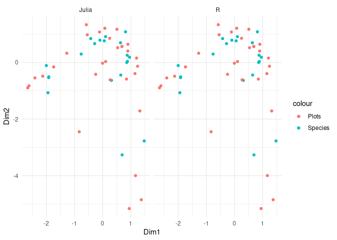

# Correspondence Analysis


## Outline

This page details how to perform correspondence analysis in Julia
following the computational algorithm outlined in appendix A of
Greenacre (2017) and implemented in the R package `ca` (Nenadic and
Greenacre 2007).

The Julia package MultivariateStats.jl does not currently contain an
implementation of correspondence analysis.

## Import Required Packages

## Julia

``` julia
using Pkg; Pkg.activate("docs")
using EcoVeg
using NamedArrays
using LinearAlgebra
using CSV
using BenchmarkTools
using DataFrames
# using Plots
```

## R

``` r
library(ca)
library(microbenchmark)
library(ggplot2)
library(dplyr)
```


    Attaching package: 'dplyr'

    The following objects are masked from 'package:stats':

        filter, lag

    The following objects are masked from 'package:base':

        intersect, setdiff, setequal, union

``` r
library(JuliaCall)
```

## Create example data

Create example data in the form of a site by species named matrix, N.

<details class="code-fold">
<summary>Code</summary>

``` julia
N = generate_test_array(rown = 20, coln = 30, meancoloccs = 10, rowprefix = "SiteA-", colprefix = "Species")
```

</details>

    20×30 Named Matrix{Float64}
    Releve ╲ Species │   Species1    Species2  …   Species29   Species30
    ─────────────────┼──────────────────────────────────────────────────
    SiteA-1          │        0.0         0.0  …         0.0         0.0
    SiteA-2          │   0.164662   0.0936614            0.0         0.0
    SiteA-3          │   0.154406         0.0            0.0         0.0
    SiteA-4          │        0.0         0.0            0.0   0.0878286
    SiteA-5          │        0.0         0.0        0.15232         0.0
    SiteA-6          │  0.0422097         0.0            0.0         0.0
    SiteA-7          │   0.174271    0.153655            0.0   0.0613221
    SiteA-8          │   0.167771         0.0            0.0         0.0
    ⋮                           ⋮           ⋮  ⋱           ⋮           ⋮
    SiteA-13         │   0.136191   0.0530328      0.0382785         0.0
    SiteA-14         │        0.0         0.0       0.159143         0.0
    SiteA-15         │        0.0   0.0581085      0.0687663  0.00675044
    SiteA-16         │        0.0    0.131618            0.0         0.0
    SiteA-17         │        0.0         0.0            0.0   0.0365927
    SiteA-18         │  0.0281285   0.0955669            0.0    0.165666
    SiteA-19         │   0.106493         0.0            0.0         0.0
    SiteA-20         │        0.0         0.0  …   0.0146647         0.0

<!-- ## Perform $\chi^{2}$ test

Perform a chi-squared ($\chi^{2}$) test to check whether there is asignificant dependence between the rows and columns. -->

## A.1 Create the correspondence matrix

``` markdown
Calculate the correspondence matrix $P$ following @eq-p.

$$
P = \frac{1}{n}N
$$ {#eq-p}
```

``` julia
begin
  n = sum(N)
  P = N / n
end
```

    20×30 Named Matrix{Float64}
    Releve ╲ Species │    Species1     Species2  …    Species29    Species30
    ─────────────────┼──────────────────────────────────────────────────────
    SiteA-1          │         0.0          0.0  …          0.0          0.0
    SiteA-2          │   0.0082331   0.00468307             0.0          0.0
    SiteA-3          │  0.00772029          0.0             0.0          0.0
    SiteA-4          │         0.0          0.0             0.0   0.00439143
    SiteA-5          │         0.0          0.0      0.00761602          0.0
    SiteA-6          │  0.00211049          0.0             0.0          0.0
    SiteA-7          │  0.00871354   0.00768277             0.0   0.00306611
    SiteA-8          │  0.00838856          0.0             0.0          0.0
    ⋮                            ⋮            ⋮  ⋱            ⋮            ⋮
    SiteA-13         │  0.00680954   0.00265164      0.00191392          0.0
    SiteA-14         │         0.0          0.0      0.00795717          0.0
    SiteA-15         │         0.0   0.00290542      0.00343832  0.000337522
    SiteA-16         │         0.0   0.00658088             0.0          0.0
    SiteA-17         │         0.0          0.0             0.0   0.00182964
    SiteA-18         │  0.00140643   0.00477835             0.0   0.00828331
    SiteA-19         │  0.00532463          0.0             0.0          0.0
    SiteA-20         │         0.0          0.0  …  0.000733237          0.0

## A.2 Calculate column and row masses

``` markdown
Calculate the row and and column masses using @eq-row_masses and @eq-column_masses respectively.

$$
r = P1 \space \space
r_{i} = \sum^{J}_{j = 1} P_{ij}
$$ {#eq-row_masses}
```

``` markdown
$$
c = P^{t}1 \space \space
c_{j} = \sum^{I}_{i = 1} P_{ij}
$$ {#eq-column_masses}
```

``` julia
r = vec(sum(P, dims = 2))
```

    20-element Vector{Float64}:
     0.05
     0.05
     0.04999999999999999
     0.049999999999999996
     0.049999999999999996
     0.049999999999999975
     0.05
     0.049999999999999996
     0.04999999999999999
     0.05
     0.049999999999999996
     0.049999999999999996
     0.049999999999999996
     0.049999999999999975
     0.049999999999999996
     0.04999999999999999
     0.049999999999999996
     0.04999999999999998
     0.04999999999999998
     0.04999999999999999

``` julia
c = vec(sum(P, dims = 1))
```

    30-element Vector{Float64}:
     0.06242175930346598
     0.030336689421837634
     0.024417474841065736
     0.011236333558953641
     0.023256756434305484
     0.02740591986283429
     0.04329482947731683
     0.0418674696871211
     0.02205529997017692
     0.05209312097873284
     ⋮
     0.05144583704123703
     0.009401856450938759
     0.024337135096116916
     0.03692637226439267
     0.040825754385220035
     0.02827244127586385
     0.017112629450118814
     0.028199086410775443
     0.01790800682139619

## A.3 Diagonal matrices of row and column masses

``` julia
Dr = Diagonal(r)
```

    20×20 Diagonal{Float64, Vector{Float64}}:
     0.05   ⋅     ⋅     ⋅     ⋅     ⋅    …   ⋅     ⋅     ⋅     ⋅     ⋅     ⋅ 
      ⋅    0.05   ⋅     ⋅     ⋅     ⋅        ⋅     ⋅     ⋅     ⋅     ⋅     ⋅ 
      ⋅     ⋅    0.05   ⋅     ⋅     ⋅        ⋅     ⋅     ⋅     ⋅     ⋅     ⋅ 
      ⋅     ⋅     ⋅    0.05   ⋅     ⋅        ⋅     ⋅     ⋅     ⋅     ⋅     ⋅ 
      ⋅     ⋅     ⋅     ⋅    0.05   ⋅        ⋅     ⋅     ⋅     ⋅     ⋅     ⋅ 
      ⋅     ⋅     ⋅     ⋅     ⋅    0.05  …   ⋅     ⋅     ⋅     ⋅     ⋅     ⋅ 
      ⋅     ⋅     ⋅     ⋅     ⋅     ⋅        ⋅     ⋅     ⋅     ⋅     ⋅     ⋅ 
      ⋅     ⋅     ⋅     ⋅     ⋅     ⋅        ⋅     ⋅     ⋅     ⋅     ⋅     ⋅ 
      ⋅     ⋅     ⋅     ⋅     ⋅     ⋅        ⋅     ⋅     ⋅     ⋅     ⋅     ⋅ 
      ⋅     ⋅     ⋅     ⋅     ⋅     ⋅        ⋅     ⋅     ⋅     ⋅     ⋅     ⋅ 
      ⋅     ⋅     ⋅     ⋅     ⋅     ⋅    …   ⋅     ⋅     ⋅     ⋅     ⋅     ⋅ 
      ⋅     ⋅     ⋅     ⋅     ⋅     ⋅        ⋅     ⋅     ⋅     ⋅     ⋅     ⋅ 
      ⋅     ⋅     ⋅     ⋅     ⋅     ⋅        ⋅     ⋅     ⋅     ⋅     ⋅     ⋅ 
      ⋅     ⋅     ⋅     ⋅     ⋅     ⋅        ⋅     ⋅     ⋅     ⋅     ⋅     ⋅ 
      ⋅     ⋅     ⋅     ⋅     ⋅     ⋅       0.05   ⋅     ⋅     ⋅     ⋅     ⋅ 
      ⋅     ⋅     ⋅     ⋅     ⋅     ⋅    …   ⋅    0.05   ⋅     ⋅     ⋅     ⋅ 
      ⋅     ⋅     ⋅     ⋅     ⋅     ⋅        ⋅     ⋅    0.05   ⋅     ⋅     ⋅ 
      ⋅     ⋅     ⋅     ⋅     ⋅     ⋅        ⋅     ⋅     ⋅    0.05   ⋅     ⋅ 
      ⋅     ⋅     ⋅     ⋅     ⋅     ⋅        ⋅     ⋅     ⋅     ⋅    0.05   ⋅ 
      ⋅     ⋅     ⋅     ⋅     ⋅     ⋅        ⋅     ⋅     ⋅     ⋅     ⋅    0.05

``` julia
Dc = Diagonal(c)
```

    30×30 Diagonal{Float64, Vector{Float64}}:
     0.0624218   ⋅          ⋅         …   ⋅          ⋅          ⋅ 
      ⋅         0.0303367   ⋅             ⋅          ⋅          ⋅ 
      ⋅          ⋅         0.0244175      ⋅          ⋅          ⋅ 
      ⋅          ⋅          ⋅             ⋅          ⋅          ⋅ 
      ⋅          ⋅          ⋅             ⋅          ⋅          ⋅ 
      ⋅          ⋅          ⋅         …   ⋅          ⋅          ⋅ 
      ⋅          ⋅          ⋅             ⋅          ⋅          ⋅ 
      ⋅          ⋅          ⋅             ⋅          ⋅          ⋅ 
      ⋅          ⋅          ⋅             ⋅          ⋅          ⋅ 
      ⋅          ⋅          ⋅             ⋅          ⋅          ⋅ 
     ⋮                                ⋱                        
      ⋅          ⋅          ⋅             ⋅          ⋅          ⋅ 
      ⋅          ⋅          ⋅             ⋅          ⋅          ⋅ 
      ⋅          ⋅          ⋅             ⋅          ⋅          ⋅ 
      ⋅          ⋅          ⋅             ⋅          ⋅          ⋅ 
      ⋅          ⋅          ⋅         …   ⋅          ⋅          ⋅ 
      ⋅          ⋅          ⋅             ⋅          ⋅          ⋅ 
      ⋅          ⋅          ⋅            0.0171126   ⋅          ⋅ 
      ⋅          ⋅          ⋅             ⋅         0.0281991   ⋅ 
      ⋅          ⋅          ⋅             ⋅          ⋅         0.017908

## A.4 Calculate the matrix of standardized residuals

``` markdown
$$
SR = D_{r}^{-\frac{1}{2}}(P - rc^{T})D_{c}^{-\frac{1}{2}}
$$ {#eq-standardized_residuals}
```

``` julia
SR = Dr^(-1/2) * (P - r * transpose(c)) * Dc^(-1/2)
```

    20×30 Named Matrix{Float64}
    Releve ╲ Species │    Species1     Species2  …    Species29    Species30
    ─────────────────┼──────────────────────────────────────────────────────
    SiteA-1          │  -0.0558667   -0.0389466  …   -0.0375494   -0.0299232
    SiteA-2          │   0.0915037    0.0812969      -0.0375494   -0.0299232
    SiteA-3          │   0.0823245   -0.0389466      -0.0375494   -0.0299232
    SiteA-4          │  -0.0558667   -0.0389466      -0.0375494     0.116833
    SiteA-5          │  -0.0558667   -0.0389466        0.165278   -0.0299232
    SiteA-6          │  -0.0180895   -0.0389466      -0.0375494   -0.0299232
    SiteA-7          │    0.100103     0.158318      -0.0375494    0.0725425
    SiteA-8          │   0.0942865   -0.0389466      -0.0375494   -0.0299232
    ⋮                            ⋮            ⋮  ⋱            ⋮            ⋮
    SiteA-13         │   0.0660223    0.0291375       0.0134215   -0.0299232
    SiteA-14         │  -0.0558667   -0.0389466        0.174363   -0.0299232
    SiteA-15         │  -0.0558667    0.0356537       0.0540185   -0.0186436
    SiteA-16         │  -0.0558667     0.130026      -0.0375494   -0.0299232
    SiteA-17         │  -0.0558667   -0.0389466      -0.0375494    0.0312211
    SiteA-18         │   -0.030692    0.0837433      -0.0375494     0.246896
    SiteA-19         │   0.0394428   -0.0389466      -0.0375494   -0.0299232
    SiteA-20         │  -0.0558667   -0.0389466  …   -0.0180221   -0.0299232

## A.5 Calculate the Singular Value Decomposition (SVD) of S

``` julia
begin
  svd = LinearAlgebra.svd(SR)
  U = svd.U
  S = svd.S
  V = svd.V
  Vt = svd.Vt
end
```

    20×30 Matrix{Float64}:
     -0.00435365  -0.12054    -0.0103767   …  -0.2023       0.00578967
      0.358463     0.254768   -0.165654       -0.353944     0.126832
     -0.0720393    0.0062444   0.0518127      -0.191196     0.279125
     -0.0308529    0.254494    0.107747       -0.00644227   0.339832
     -0.263297     0.192573   -0.0944804       0.0719118    0.0972595
      0.102404     0.0225048  -0.0979738   …  -0.194209    -0.238853
     -0.038568    -0.0918263   0.168725       -0.245323     0.0508806
     -0.0516729   -0.0160058  -0.142925        0.180373    -0.125216
      0.314991    -0.105272   -0.0403872       0.0870616   -0.196858
      0.116631    -0.165536   -0.0781826       0.223346    -0.00198167
     -0.161451    -0.21706     0.0310513   …  -0.0589985   -0.078493
     -0.0374005    0.312827    0.0456166       0.110742    -0.0498213
     -0.124641    -0.0708134  -0.340622        0.133984     0.449057
      0.415064     0.029204    0.0489769       0.0382038    0.204825
      0.0804593    0.301285   -0.107038       -0.0797646   -0.19309
      0.138842     0.311094    0.180097    …   0.247266    -0.0486915
      0.192082    -0.0266423  -0.279959        0.0994312   -0.00289005
      0.0745857    0.146279    0.125657       -0.138485    -0.234867
      0.082795     0.0775415   0.178353       -0.255109    -0.169398
     -0.437329     0.0163395   0.00371575     -0.108152    -0.0401564

## A.6 Standard coordinates *Φ* of rows

``` markdown
$$
\Phi = D_{r}^{-\frac{1}{2}} U
$$ {#eq-standard_coordinates_rows}
```

``` julia
Φ = Dr^(-1/2) * U
```

    20×20 Matrix{Float64}:
      1.81661    -0.138493   -1.01894    …  -0.421151   0.889969   -1.0
     -2.21335     2.33016    -0.740083      -0.814851  -0.0286263  -1.0
      0.600871    0.348659    1.37218        0.807438  -1.03069    -1.0
     -0.388163   -0.119437    2.39351        1.02883    0.316485   -1.0
     -1.48442    -2.39152    -0.792373       1.01096   -0.0926924  -1.0
      0.343341   -0.173452   -1.13129    …  -0.357901   0.358886   -1.0
     -0.359375    1.43896    -0.209854       0.299627   2.09798    -1.0
      1.53567     0.620525   -0.589057      -0.868616  -0.618023   -1.0
      0.621686    0.62441    -0.709749       0.577646  -1.1502     -1.0
      1.6428      0.593474   -0.0576056      0.958925   0.641799   -1.0
      0.36281    -0.814279   -0.454443   …   1.58578    1.03066    -1.0
     -1.18477    -0.304777   -0.699129       0.332015  -1.57356    -1.0
     -1.00795     0.79526    -0.814948       1.35917    0.576168   -1.0
     -0.0677419  -1.42207    -0.153033      -1.63988    1.4722     -1.0
      0.318538   -0.85954    -1.13904       -0.546519  -1.7691     -1.0
      0.194363   -0.0626394   1.07507    …   1.13555   -0.558194   -1.0
     -0.135962   -0.44786     1.1992        -0.710281   0.132342   -1.0
      0.413197    0.804752    1.00301       -1.00316   -1.18272    -1.0
     -0.46758    -0.664653    1.29936       -1.68604    0.676605   -1.0
     -0.540583   -0.157474    0.167208      -1.04755   -0.189286   -1.0

``` julia
# NamedArrays.setnames!(NamedArray(Φ), names = vec(names(N)[1]))
# NamedArray(Φ, names(N)[1])
```

## A.7 Standard coordinates *Γ* of columns

``` markdown
$$
\Gamma = D_{c}^{-\frac{1}{2}} V
$$ {#eq-standard_coordinates_columns}
```

``` julia
Γ = Dc^(-1/2) * V
```

    30×20 Matrix{Float64}:
     -0.0174255   1.43475   -0.288338   …   0.29853     0.331387    -1.75041
     -0.692068    1.46272    0.0358514      0.839845    0.445195     0.0938111
     -0.066406   -1.06011    0.331578       0.804149    1.14138      0.0237792
     -1.69431    -3.14307   -0.250222       3.18754    -0.17797     -0.267077
     -2.66229     2.44785   -1.36875        0.228709   -1.00011      0.680425
      0.0178716   0.07299    0.347745   …   0.0323598   1.18018     -1.20084
      0.717799    0.260525   0.41774        0.187601   -0.00338376  -0.879327
     -1.10762    -0.880795   0.561007      -0.794709    1.73408     -0.922313
      1.06282    -1.21631   -1.00924       -2.20446     0.993067    -1.24745
      0.5762     -0.238737   0.408488       0.845877   -0.857103    -1.09269
      ⋮                                 ⋱                           
      1.84852     0.8209    -0.151991      -0.196201   -0.122899    -0.937398
      2.09437     0.689419  -1.01721       -2.88223    -1.58156      0.220693
      0.0294073  -0.241848   2.73891       -0.3082     -1.08704     -0.514006
     -0.986255   -1.09768   -1.16051       -0.680982   -0.160503    -1.49739
      0.0751799  -0.380309   1.84284    …  -1.33033     0.694979    -1.03796
      0.267102   -1.46692   -1.37316        1.09894     0.268589    -1.27749
     -1.10736     0.826     -0.524398      -0.0201985   2.21024     -0.695068
     -1.2047     -2.10774   -1.13857       -0.824679   -1.51918     -0.644048
      0.0432644   0.947772   2.08581       -1.75508    -1.26586     -0.300076

## A.8 Principal coordinates F of rows

``` markdown
$$
F = D_{r}^{-\frac{1}{2}} U D_{\alpha} = \Phi D_{\alpha}
$$ {#eq-principal_coordinates_rows}
```

``` julia
F = Φ * Diagonal(S)
```

    20×20 Matrix{Float64}:
      1.11354    -0.0770602  -0.545181   -0.236412   …   0.0914481   -1.78061e-16
     -1.35672     1.29655    -0.395978   -0.624042      -0.00294147  -1.78061e-16
      0.368318    0.194001    0.734179   -0.594072      -0.105908    -1.78061e-16
     -0.237934   -0.0664573   1.28064    -0.317895       0.0325202   -1.78061e-16
     -0.909911   -1.33069    -0.423955   -0.211541      -0.00952453  -1.78061e-16
      0.210459   -0.0965124  -0.605294    0.0789769  …   0.036877    -1.78061e-16
     -0.220288    0.800667   -0.112282    0.987349       0.215576    -1.78061e-16
      0.941323    0.345273   -0.315172   -0.532089      -0.0635045   -1.78061e-16
      0.381077    0.347435   -0.379748    0.501673      -0.118188    -1.78061e-16
      1.007       0.330222   -0.0308216  -0.679721       0.0659475   -1.78061e-16
      0.222393   -0.453082   -0.243148    0.481718   …   0.105905    -1.78061e-16
     -0.726233   -0.169585   -0.374066    0.276225      -0.16169     -1.78061e-16
     -0.617845    0.4425     -0.436034   -0.20976        0.0592037   -1.78061e-16
     -0.041524   -0.791269   -0.0818798  -0.0444038      0.151274    -1.78061e-16
      0.195256   -0.478266   -0.609438    0.213182      -0.181783    -1.78061e-16
      0.11914    -0.0348539   0.575213    0.131569   …  -0.0573568   -1.78061e-16
     -0.0833413  -0.249199    0.641629    0.323233       0.0135987   -1.78061e-16
      0.253279    0.447781    0.536655    1.10663       -0.121529    -1.78061e-16
     -0.286615   -0.369827    0.695218   -0.0418613      0.069524    -1.78061e-16
     -0.331363   -0.0876216   0.0894637  -0.608756      -0.0194499   -1.78061e-16

## A.9 Principal coordinates G of columns

``` markdown
$$
G = D_{c}^{-\frac{1}{2}} V D_{\alpha} = \Gamma D_{\alpha}
$$ {#eq-principal_coordinates_rows}
```

``` julia
G = Γ * Diagonal(S)
```

    30×20 Matrix{Float64}:
     -0.0106814   0.798325   -0.154274   …   0.0340515    -3.1168e-16
     -0.42422     0.813887    0.0191821      0.0457457     1.67041e-17
     -0.0407051  -0.58987     0.177409       0.117282      4.23414e-18
     -1.03857    -1.74887    -0.13388       -0.0182872    -4.75559e-17
     -1.63191     1.36204    -0.732344      -0.102765      1.21157e-16
      0.0109548   0.0406132   0.186059   …   0.121269     -2.13823e-16
      0.439992    0.144962    0.22351       -0.000347696  -1.56574e-16
     -0.678944   -0.490093    0.300164       0.178185     -1.64228e-16
      0.651482   -0.676781   -0.539989       0.102042     -2.22123e-16
      0.353195   -0.132838    0.21856       -0.088071     -1.94566e-16
      ⋮                                  ⋱                
      1.13309     0.456766   -0.0813218     -0.0126284    -1.66914e-16
      1.28379     0.383607   -0.544254      -0.162512      3.92968e-17
      0.0180259  -0.134569    1.46544       -0.111698     -9.15242e-17
     -0.604548   -0.610772   -0.620924      -0.0164923    -2.66627e-16
      0.0460833  -0.211612    0.986004   …   0.0714121    -1.84819e-16
      0.163727   -0.816226   -0.734704       0.0275986    -2.2747e-16
     -0.678782    0.459604   -0.280577       0.227112     -1.23764e-16
     -0.738449   -1.17279    -0.609189      -0.156102     -1.1468e-16
      0.0265199   0.52736     1.116         -0.130072     -5.34317e-17

## A.10 Principal inertias *λ*<sub>*k*</sub>

``` markdown
$$
\lambda_{k} = \alpha_{k}^{2}, k = 1,2,...,\space where \space k = min\{I-1,J-1\}
$$ {#eq-principal_inertias}
```

``` julia
F * Dr * transpose(F)
```

    20×20 Matrix{Float64}:
      0.176253    -0.0454704   -0.0105812   …  -0.05        -0.0256362
     -0.0454704    0.23503     -0.0260535      -0.0208237    0.0135401
     -0.0105812   -0.0260535    0.11912         0.00985987   0.00639501
     -0.0147665    0.00195209   0.0284484       0.0414594    0.0085983
     -0.0378862   -0.00392637  -0.0291341       0.00908341   0.00904514
      0.00940733  -0.0156465    0.00628911  …  -0.0234246   -0.00179829
     -0.0358464    0.0121606   -0.00625708     -0.0171513   -0.0126337
      0.0296712   -0.0226316    0.0236612      -0.0227864   -0.0217639
     -0.00171182  -0.0132764   -0.0196894       0.00764449  -0.0221735
      0.0318926   -0.028182     0.0293717      -0.021659     0.0107294
     -0.00807035  -0.0359453   -0.0402731   …   0.0198137   -0.00487048
     -0.0167785    0.0177558   -0.0352565      -0.00541133   0.00605225
     -0.0183492    0.0720551   -0.0108305      -0.0183123   -0.00224457
      0.0050594   -0.0429869   -0.00914798     -0.0193381   -0.0168132
      0.033175    -0.0381485   -0.0373476      -0.00668456  -0.00511196
      0.0244796   -0.0114368   -0.0125286   …   0.0055519    0.00136159
     -0.0436804   -0.0298107    0.02781         0.0140449   -0.0221752
     -0.00116046  -0.0181548   -0.0138556      -0.0260911   -0.0443216
     -0.05        -0.0208237    0.00985987      0.108656     0.0155683
     -0.0256362    0.0135401    0.00639501      0.0155683    0.108252

``` julia
G * Dr * transpose(G)
```

    30×30 Matrix{Float64}:
      0.0703593     0.0187961   -0.0211723   …  -0.0425959   -0.0156783
      0.0187961     0.127854    -0.0139671      -0.0243274    0.0680213
     -0.0211723    -0.0139671    0.0734397       0.00732181   0.0124624
     -0.05         -0.05         0.0733391       0.130781    -0.0162191
      0.0497339     0.0601621   -0.05            0.0096195   -0.05
     -0.0181222     0.0235135    0.0491405   …  -0.00177475   0.124752
      0.00580183   -0.0439472   -0.00865425     -0.0299118   -0.0344922
     -0.0139402    -0.0239749    0.0259024       0.0213263   -0.0128525
     -0.05          0.00592816  -0.0150466       0.0462687   -0.0458599
     -0.0139797    -0.00873938  -0.0108794      -0.0273272   -0.0204895
      ⋮                                      ⋱               
      0.0139957    -0.0221852   -0.0120665      -0.05         0.0104504
      0.0369838    -0.0221338   -0.0420271      -0.0450191   -0.05
      0.000500339  -0.0406282    0.0179369      -0.0357769    0.0570096
     -0.0206885    -0.0168495    0.00873939      0.10958     -0.043624
     -0.0167013     0.00539142   0.0110833   …  -0.0209499    0.0405095
     -0.020262     -0.0338295    0.0495302       0.0427188   -0.0468177
      0.00735394    0.06883     -0.0476658       0.0387278    0.0289702
     -0.0425959    -0.0243274    0.00732181      0.176513    -0.0477019
     -0.0156783     0.0680213    0.0124624      -0.0477019    0.264192

## Create Correspondence Analysis Function

``` julia
function correspondence_analysis(N::NamedMatrix)
  
  # A.1 Create the correspondence matrix
  P = N / sum(N)

  # A.2 Calculate column and row masses
  r = vec(sum(P, dims = 2))
  c = vec(sum(P, dims = 1))

  # A.3 Diagonal matrices of row and column masses
  Dr = Diagonal(r)
  Dc = Diagonal(c)

  # A.4 Calculate the matrix of standardized residuals
  SR = Dr^(-1/2) * (P - r * transpose(c)) * Dc^(-1/2)

  # A.5 Calculate the Singular Value Decomposition (SVD) of S
  svd = LinearAlgebra.svd(SR)
  U = svd.U
  V = svd.V
  S = svd.S
  D = Diagonal(S)

  # A.6 Standard coordinates Φ of rows
  Φ_rownames = names(N)[1]
  Φ_colnames = vec(["Dim"].*string.([1:1:size(N,1);]))
  Φ = NamedArray(Dr^(-1/2) * U, names = (Φ_rownames, Φ_colnames), dimnames = ("Plot", "Dimension"))
  
  # A.7 Standard coordinates Γ of columns
  Γ_rownames = names(N)[2]
  Γ_colnames = vec(["Dim"].*string.([1:1:size(N,1);]))
  Γ = NamedArray(Dc^(-1/2) * V, names = (Γ_rownames, Γ_colnames), dimnames = ("Species", "Dimension"))
  
  # A.8 Principal coordinates F of rows
  # F = Φ * D
  F = Dr^(-1/2) * U * D
  
  # A.9 Principal coordinates G of columns
  # G = Γ * D
  G = Dc^(-1/2) * V * D

  # [1:end, 1:end .∉ [[20]]]

  results = (sv = D, # Singular values
             rownames = names(N)[1], # Row names
             rowmass = r, # Row masses
            #  rowdist = , # Row chi-square distances to centroid
            #  rowinertia = , # Row inertias
             rowcoord = Φ, # Row standard coordinates
            #  rowsup = , # Indicies of row supplementary points
             colnames = names(N)[2], # Column names
             colmass = c, # Column masses
            #  coldist = , # Column chi-square distances to centroid
            #  colinertia = , # Column inertias
             colcoord = Γ, # Column standard coordinates
            #  colsup = , # Indices of column supplementary points
            N = N # The frequency table
            )

  return results

end
```

    correspondence_analysis (generic function with 1 method)

### Test Function

``` julia
ca_results = correspondence_analysis(N)
```

    (sv = [0.6129739490525447 0.0 … 0.0 0.0; 0.0 0.5564212400123917 … 0.0 0.0; … ; 0.0 0.0 … 0.10275423676403479 0.0; 0.0 0.0 … 0.0 1.7806076093874553e-16], rownames = ["SiteA-1", "SiteA-2", "SiteA-3", "SiteA-4", "SiteA-5", "SiteA-6", "SiteA-7", "SiteA-8", "SiteA-9", "SiteA-10", "SiteA-11", "SiteA-12", "SiteA-13", "SiteA-14", "SiteA-15", "SiteA-16", "SiteA-17", "SiteA-18", "SiteA-19", "SiteA-20"], rowmass = [0.05, 0.05, 0.04999999999999999, 0.049999999999999996, 0.049999999999999996, 0.049999999999999975, 0.05, 0.049999999999999996, 0.04999999999999999, 0.05, 0.049999999999999996, 0.049999999999999996, 0.049999999999999996, 0.049999999999999975, 0.049999999999999996, 0.04999999999999999, 0.049999999999999996, 0.04999999999999998, 0.04999999999999998, 0.04999999999999999], rowcoord = [1.8166144123541197 -0.13849250719179576 … 0.8899688488193661 -0.9999999999999999; -2.2133481188635744 2.3301565201989045 … -0.028626295379941775 -1.0000000000000007; … ; -0.46758048803987456 -0.6646526282674122 … 0.6766050054032159 -0.9999999999999983; -0.540582877993106 -0.15747352141916915 … -0.18928550199583283 -0.9999999999999999], colnames = ["Species1", "Species2", "Species3", "Species4", "Species5", "Species6", "Species7", "Species8", "Species9", "Species10"  …  "Species21", "Species22", "Species23", "Species24", "Species25", "Species26", "Species27", "Species28", "Species29", "Species30"], colmass = [0.06242175930346598, 0.030336689421837634, 0.024417474841065736, 0.011236333558953641, 0.023256756434305484, 0.02740591986283429, 0.04329482947731683, 0.0418674696871211, 0.02205529997017692, 0.05209312097873284  …  0.025759260841475992, 0.05144583704123703, 0.009401856450938759, 0.024337135096116916, 0.03692637226439267, 0.040825754385220035, 0.02827244127586385, 0.017112629450118814, 0.028199086410775443, 0.01790800682139619], colcoord = [-0.017425518201538735 1.4347495282213645 … 0.33138731443973585 -1.7504124145267335; -0.6920677954506225 1.4627168584763466 … 0.4451950502466801 0.09381111444515973; … ; -1.204698348017798 -2.107741047756947 … -1.5191755409156609 -0.6440476860846754; 0.04326438705287024 0.9477720028495215 … -1.2658585618213798 -0.3000758730534765], N = [0.0 0.0 … 0.0 0.0; 0.16466200290071414 0.09366135428474028 … 0.0 0.0; … ; 0.10649256780454618 0.0 … 0.0 0.0; 0.0 0.0 … 0.014664730921840953 0.0])

### Plot Test Results

``` julia
begin
  plots_x = ca_results.rowcoord[:,"Dim1"]
  plots_y = ca_results.rowcoord[:,"Dim2"]

  species_x = ca_results.colcoord[:,"Dim1"]
  species_y = ca_results.colcoord[:,"Dim2"]

  # scatter(species_x, species_y, series_annotations = text.(ca_results.colnames, 8, :right, :bottom), framestyle=:origin, label = "Species")
  # scatter!(plots_x, plots_y, series_annotations = text.(ca_results.rownames, 8, :right, :bottom), label = "Plots")
end
```

    30-element Named Vector{Float64}
    Species   │ 
    ──────────┼──────────
    Species1  │   1.43475
    Species2  │   1.46272
    Species3  │  -1.06011
    Species4  │  -3.14307
    Species5  │   2.44785
    Species6  │   0.07299
    Species7  │  0.260525
    Species8  │ -0.880795
    ⋮                   ⋮
    Species23 │  0.689419
    Species24 │ -0.241848
    Species25 │  -1.09768
    Species26 │ -0.380309
    Species27 │  -1.46692
    Species28 │     0.826
    Species29 │  -2.10774
    Species30 │  0.947772

## R vs Julia Dune Data

Let’s see how the R function `ca::ca()` compares to the Julia function
`correspondence_analysis()` defined above.

First load the `dune` dataset bundled in `{vegan}`.

## Julia

``` julia
begin
    dune_df = CSV.read("../data/dune.csv", DataFrame, header = 1)
    dune_na = NamedArray(Array(dune_df))
    NamedArrays.setnames!(dune_na, names(dune_df), 2)
end
```

    (OrderedCollections.OrderedDict{Any, Int64}("1" => 1, "2" => 2, "3" => 3, "4" => 4, "5" => 5, "6" => 6, "7" => 7, "8" => 8, "9" => 9, "10" => 10…), OrderedCollections.OrderedDict{Any, Int64}("Achimill" => 1, "Agrostol" => 2, "Airaprae" => 3, "Alopgeni" => 4, "Anthodor" => 5, "Bellpere" => 6, "Bromhord" => 7, "Chenalbu" => 8, "Cirsarve" => 9, "Comapalu" => 10…))

## R

``` r
dune <- as.matrix(read.csv(file = "../data/dune.csv"))
```

### Run CA in Julia on Dune data

``` julia
dune_ca_julia = correspondence_analysis(dune_na)
```

    (sv = [0.7321237072731497 0.0 … 0.0 0.0; 0.0 0.6325690627910964 … 0.0 0.0; … ; 0.0 0.0 … 0.05896537573383853 0.0; 0.0 0.0 … 0.0 7.091790502929597e-17], rownames = ["1", "2", "3", "4", "5", "6", "7", "8", "9", "10", "11", "12", "13", "14", "15", "16", "17", "18", "19", "20"], rowmass = [0.02627737226277372, 0.06131386861313868, 0.05839416058394161, 0.0656934306569343, 0.06277372262773723, 0.07007299270072993, 0.05839416058394161, 0.05839416058394161, 0.06131386861313869, 0.06277372262773723, 0.04671532846715329, 0.051094890510948905, 0.04817518248175183, 0.03503649635036496, 0.03357664233576642, 0.04817518248175183, 0.0218978102189781, 0.03941605839416058, 0.04525547445255475, 0.04525547445255475], rowcoord = [0.8116737226994164 1.0826713631197626 … 2.417299499470586 0.9999999999999976; 0.6326772260449806 0.6958357017624843 … -0.049159624022002205 0.9999999999999993; … ; 0.6902687683328907 -3.2642026272615623 … 0.014843350243563693 1.0; -1.9443804612344018 -1.0688808878703615 … -1.087127732821526 1.0000000000000004], colnames = ["Achimill", "Agrostol", "Airaprae", "Alopgeni", "Anthodor", "Bellpere", "Bromhord", "Chenalbu", "Cirsarve", "Comapalu"  …  "Ranuflam", "Rumeacet", "Sagiproc", "Salirepe", "Scorautu", "Trifprat", "Trifrepe", "Vicilath", "Bracruta", "Callcusp"], colmass = [0.02335766423357664, 0.07007299270072993, 0.0072992700729927005, 0.05255474452554745, 0.030656934306569343, 0.01897810218978102, 0.021897810218978103, 0.00145985401459854, 0.00291970802919708, 0.00583941605839416  …  0.020437956204379562, 0.026277372262773723, 0.029197080291970802, 0.016058394160583942, 0.07883211678832117, 0.01313868613138686, 0.06861313868613139, 0.00583941605839416, 0.07153284671532847, 0.014598540145985401], colcoord = [1.2410388912758308 -0.13374974813501736 … 1.0922556626083908 0.5378610945054166; -1.275443784762892 0.3264688587581394 … -1.3054088243241777 0.6482522649395861; … ; -0.2488978439865396 -0.4185696756019523 … -0.01770675187655213 -0.49012289845882706; -2.6661966956330643 -0.8970175654454415 … -0.22298366681774884 -0.2585309105382417], N = [1 0 … 0 0; 3 0 … 0 0; … ; 0 0 … 3 0; 0 5 … 4 3])

### Run CA in R using Dune data

``` r
dune_ca_r <- ca::ca(dune)
```

``` r
dune_ca_coords_r <- ca::cacoord(dune_ca_r)
dune_ca_r_rowcoord <- dune_ca_coords_r$rows
dune_ca_r_colcoord <- dune_ca_coords_r$columns
```

### Check equality of R and Julia CA results

Check whether the standard row (plot) and column (species) coordinates
produced by the Julia function `correspondence_analaysis()` the R
function `ca::ca()` are identical.

First retrieve the Julia results in R.

``` r
dune_ca_julia <- JuliaCall::julia_eval("dune_ca_julia")
dune_ca_julia_rowcoord <- dune_ca_julia$rowcoord
dune_ca_julia_colcoord <- dune_ca_julia$colcoord
```

Then check for equivalence. Note that there are two differences in R and
Julia data structure:

1.  Row and column names are stripped from the Julia results when
    calling `JuliaCall::julia_eval("dune_ca_julia")`, so the R results
    are also unnamed.
2.  The Julia results contain an additional dimension, populated with
    1.0 values.

These differences are corrected below whilst checking for equivalence.

The R function `all.equal` is used rather than `identical` as the Julia
implementation returns results with higher precision.

``` r
plots_allequal <- all.equal(dune_ca_julia_rowcoord[,-20], unname(dune_ca_r_rowcoord))
species_allequal <- all.equal(dune_ca_julia_colcoord[,-20], unname(dune_ca_r_colcoord))
isTRUE(all(plots_allequal, species_allequal))
```

    [1] TRUE

Let’s view the first two dimensions of the Julia and R results
side-by-side.

### Visualise standard coordinates



### Benchmark Functions

``` julia
@benchmark correspondence_analysis(dune_na)
```

    BenchmarkTools.Trial: 10000 samples with 1 evaluation.
     Range (min … max):  105.176 μs …  2.254 ms  ┊ GC (min … max): 0.00% … 86.83%
     Time  (median):     109.984 μs              ┊ GC (median):    0.00%
     Time  (mean ± σ):   114.870 μs ± 77.805 μs  ┊ GC (mean ± σ):  2.70% ±  3.79%

          ▆█▁                                                       
      ▂▅▇▆███▄▃▃▂▂▂▂▂▂▂▂▂▂▂▂▂▂▂▂▂▂▂▂▂▂▂▂▂▂▂▂▂▂▂▂▂▂▂▂▁▂▂▂▂▂▂▂▂▂▂▂▂▂ ▃
      105 μs          Histogram: frequency by time          162 μs <

     Memory estimate: 88.81 KiB, allocs estimate: 316.

``` r
microbenchmark::microbenchmark(ca::ca(dune))
```

    Unit: microseconds
             expr    min       lq     mean   median       uq     max neval
     ca::ca(dune) 440.68 446.6775 453.7794 450.4425 454.9535 574.284   100

## References

Greenacre, Michael. 2017. *Correspondence Analysis in Practice, Third
Edition*. CRC Press.

Nenadic, Oleg, and Michael Greenacre. 2007. “Correspondence Analysis in
R, with Two- and <span class="nocase">Three-dimensional Graphics</span>:
The Ca Package.” *Journal of Statistical Software* 20 (February): 1–13.
<https://doi.org/10.18637/jss.v020.i03>.
