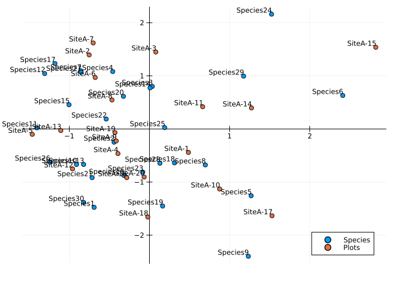

# Correspondence Analysis


## Outline

This page details how to perform correspondence analysis in Julia
following the computational algorithm outlined in appendix A of
Greenacre (2017) and implemented in the R package `ca` (Nenadic and
Greenacre 2007).

The Julia package MultivariateStats.jl does not currently contain an
implementation of correspondence analysis.

## Import Required Packages

``` julia
using EcoVeg
using NamedArrays
using LinearAlgebra
using CSV
using BenchmarkTools
using DataFrames
using Plots
```

## Create example data

Create example data in the form of a site by species named matrix, N.

``` julia
N = EcoVeg.generate_test_array(rown = 20, coln = 30, meancoloccs = 10, rowprefix = "SiteA-", colprefix = "Species")
```

    20×30 Named Matrix{Float64}
    Releve ╲ Species │   Species1    Species2  …   Species29   Species30
    ─────────────────┼──────────────────────────────────────────────────
    SiteA-1          │        0.0         0.0  …         0.0    0.136385
    SiteA-2          │        0.0         0.0            0.0   0.0513813
    SiteA-3          │        0.0         0.0            0.0    0.185207
    SiteA-4          │   0.127938    0.109735            0.0         0.0
    SiteA-5          │  0.0193202         0.0            0.0         0.0
    SiteA-6          │   0.112393         0.0       0.174804         0.0
    SiteA-7          │        0.0         0.0       0.132292         0.0
    SiteA-8          │        0.0         0.0            0.0         0.0
    SiteA-9          │        0.0         0.0      0.0535557   0.0370882
    SiteA-10         │        0.0    0.183394            0.0         0.0
    SiteA-11         │        0.0    0.073828      0.0553637         0.0
    SiteA-12         │  0.0209252         0.0            0.0         0.0
    SiteA-13         │  0.0985629    0.031221       0.160321         0.0
    SiteA-14         │        0.0   0.0326637            0.0         0.0
    SiteA-15         │  0.0275511         0.0            0.0   0.0610668
    SiteA-16         │   0.259009         0.0            0.0         0.0
    SiteA-17         │        0.0         0.0       0.160742         0.0
    SiteA-18         │        0.0    0.140953            0.0         0.0
    SiteA-19         │        0.0         0.0            0.0         0.0
    SiteA-20         │        0.0         0.0  …         0.0   0.0883915

## A.1 Create the correspondence matrix

Calculate the correspondence matrix *P* following.

``` math
P = \frac{1}{n}N
```

``` julia
begin
  n = sum(N)
  P = N / n
end
```

    20×30 Named Matrix{Float64}
    Releve ╲ Species │    Species1     Species2  …    Species29    Species30
    ─────────────────┼──────────────────────────────────────────────────────
    SiteA-1          │         0.0          0.0  …          0.0   0.00681926
    SiteA-2          │         0.0          0.0             0.0   0.00256907
    SiteA-3          │         0.0          0.0             0.0   0.00926033
    SiteA-4          │  0.00639691   0.00548676             0.0          0.0
    SiteA-5          │ 0.000966011          0.0             0.0          0.0
    SiteA-6          │  0.00561963          0.0      0.00874022          0.0
    SiteA-7          │         0.0          0.0       0.0066146          0.0
    SiteA-8          │         0.0          0.0             0.0          0.0
    SiteA-9          │         0.0          0.0      0.00267779   0.00185441
    SiteA-10         │         0.0   0.00916972             0.0          0.0
    SiteA-11         │         0.0    0.0036914      0.00276819          0.0
    SiteA-12         │  0.00104626          0.0             0.0          0.0
    SiteA-13         │  0.00492815   0.00156105      0.00801603          0.0
    SiteA-14         │         0.0   0.00163318             0.0          0.0
    SiteA-15         │  0.00137755          0.0             0.0   0.00305334
    SiteA-16         │   0.0129505          0.0             0.0          0.0
    SiteA-17         │         0.0          0.0      0.00803711          0.0
    SiteA-18         │         0.0   0.00704766             0.0          0.0
    SiteA-19         │         0.0          0.0             0.0          0.0
    SiteA-20         │         0.0          0.0  …          0.0   0.00441958

## A.2 Calculate column and row masses

Calculate the row and and column masses.

``` math
r = P1 \space \space
r_{i} = \sum^{J}_{j = 1} P_{ij}
```

``` math
c = P^{t}1 \space \space
c_{j} = \sum^{I}_{i = 1} P_{ij}
```

``` julia
r = vec(sum(P, dims = 2))
```

    20-element Vector{Float64}:
     0.04999999999999999
     0.05000000000000001
     0.04999999999999999
     0.05
     0.05000000000000001
     0.05
     0.049999999999999996
     0.04999999999999999
     0.05
     0.05
     0.04999999999999998
     0.04999999999999999
     0.04999999999999999
     0.05000000000000001
     0.05
     0.05
     0.05
     0.05
     0.05
     0.05000000000000002

``` julia
c = vec(sum(P, dims = 1))
```

    30-element Vector{Float64}:
     0.033284971999729865
     0.02858977113919195
     0.017201742521972867
     0.01775600610617543
     0.028621927964865
     0.051941566539283585
     0.03979750618401494
     0.04061112019854042
     0.041556824731949084
     0.04459494625898852
     0.016061911178557237
     0.02449897029078172
     0.036838463351309324
     ⋮
     0.020190969967031215
     0.03490629046096702
     0.026625170219234075
     0.03939243641549475
     0.022665801043163132
     0.02708519680303905
     0.05339250292471358
     0.0525251205337822
     0.008716389251477346
     0.04654279365271537
     0.03685393300224875
     0.027975981016852634

## A.3 Diagonal matrices of row and column masses

``` julia
Dr = Diagonal(r)
```

    20×20 Diagonal{Float64, Vector{Float64}}:
     0.05   ⋅     ⋅     ⋅     ⋅     ⋅    …   ⋅     ⋅     ⋅     ⋅     ⋅     ⋅ 
      ⋅    0.05   ⋅     ⋅     ⋅     ⋅        ⋅     ⋅     ⋅     ⋅     ⋅     ⋅ 
      ⋅     ⋅    0.05   ⋅     ⋅     ⋅        ⋅     ⋅     ⋅     ⋅     ⋅     ⋅ 
      ⋅     ⋅     ⋅    0.05   ⋅     ⋅        ⋅     ⋅     ⋅     ⋅     ⋅     ⋅ 
      ⋅     ⋅     ⋅     ⋅    0.05   ⋅        ⋅     ⋅     ⋅     ⋅     ⋅     ⋅ 
      ⋅     ⋅     ⋅     ⋅     ⋅    0.05  …   ⋅     ⋅     ⋅     ⋅     ⋅     ⋅ 
      ⋅     ⋅     ⋅     ⋅     ⋅     ⋅        ⋅     ⋅     ⋅     ⋅     ⋅     ⋅ 
      ⋅     ⋅     ⋅     ⋅     ⋅     ⋅        ⋅     ⋅     ⋅     ⋅     ⋅     ⋅ 
      ⋅     ⋅     ⋅     ⋅     ⋅     ⋅        ⋅     ⋅     ⋅     ⋅     ⋅     ⋅ 
      ⋅     ⋅     ⋅     ⋅     ⋅     ⋅        ⋅     ⋅     ⋅     ⋅     ⋅     ⋅ 
      ⋅     ⋅     ⋅     ⋅     ⋅     ⋅    …   ⋅     ⋅     ⋅     ⋅     ⋅     ⋅ 
      ⋅     ⋅     ⋅     ⋅     ⋅     ⋅        ⋅     ⋅     ⋅     ⋅     ⋅     ⋅ 
      ⋅     ⋅     ⋅     ⋅     ⋅     ⋅        ⋅     ⋅     ⋅     ⋅     ⋅     ⋅ 
      ⋅     ⋅     ⋅     ⋅     ⋅     ⋅        ⋅     ⋅     ⋅     ⋅     ⋅     ⋅ 
      ⋅     ⋅     ⋅     ⋅     ⋅     ⋅       0.05   ⋅     ⋅     ⋅     ⋅     ⋅ 
      ⋅     ⋅     ⋅     ⋅     ⋅     ⋅    …   ⋅    0.05   ⋅     ⋅     ⋅     ⋅ 
      ⋅     ⋅     ⋅     ⋅     ⋅     ⋅        ⋅     ⋅    0.05   ⋅     ⋅     ⋅ 
      ⋅     ⋅     ⋅     ⋅     ⋅     ⋅        ⋅     ⋅     ⋅    0.05   ⋅     ⋅ 
      ⋅     ⋅     ⋅     ⋅     ⋅     ⋅        ⋅     ⋅     ⋅     ⋅    0.05   ⋅ 
      ⋅     ⋅     ⋅     ⋅     ⋅     ⋅        ⋅     ⋅     ⋅     ⋅     ⋅    0.05

``` julia
Dc = Diagonal(c)
```

    30×30 Diagonal{Float64, Vector{Float64}}:
     0.033285   ⋅          ⋅          ⋅        …   ⋅          ⋅          ⋅ 
      ⋅        0.0285898   ⋅          ⋅            ⋅          ⋅          ⋅ 
      ⋅         ⋅         0.0172017   ⋅            ⋅          ⋅          ⋅ 
      ⋅         ⋅          ⋅         0.017756      ⋅          ⋅          ⋅ 
      ⋅         ⋅          ⋅          ⋅            ⋅          ⋅          ⋅ 
      ⋅         ⋅          ⋅          ⋅        …   ⋅          ⋅          ⋅ 
      ⋅         ⋅          ⋅          ⋅            ⋅          ⋅          ⋅ 
      ⋅         ⋅          ⋅          ⋅            ⋅          ⋅          ⋅ 
      ⋅         ⋅          ⋅          ⋅            ⋅          ⋅          ⋅ 
      ⋅         ⋅          ⋅          ⋅            ⋅          ⋅          ⋅ 
      ⋅         ⋅          ⋅          ⋅        …   ⋅          ⋅          ⋅ 
      ⋅         ⋅          ⋅          ⋅            ⋅          ⋅          ⋅ 
      ⋅         ⋅          ⋅          ⋅            ⋅          ⋅          ⋅ 
     ⋮                                         ⋱                        
      ⋅         ⋅          ⋅          ⋅            ⋅          ⋅          ⋅ 
      ⋅         ⋅          ⋅          ⋅            ⋅          ⋅          ⋅ 
      ⋅         ⋅          ⋅          ⋅        …   ⋅          ⋅          ⋅ 
      ⋅         ⋅          ⋅          ⋅            ⋅          ⋅          ⋅ 
      ⋅         ⋅          ⋅          ⋅            ⋅          ⋅          ⋅ 
      ⋅         ⋅          ⋅          ⋅            ⋅          ⋅          ⋅ 
      ⋅         ⋅          ⋅          ⋅            ⋅          ⋅          ⋅ 
      ⋅         ⋅          ⋅          ⋅        …   ⋅          ⋅          ⋅ 
      ⋅         ⋅          ⋅          ⋅            ⋅          ⋅          ⋅ 
      ⋅         ⋅          ⋅          ⋅           0.0465428   ⋅          ⋅ 
      ⋅         ⋅          ⋅          ⋅            ⋅         0.0368539   ⋅ 
      ⋅         ⋅          ⋅          ⋅            ⋅          ⋅         0.027976

## A.4 Calculate the matrix of standardized residuals

``` math
SR = D_{r}^{-\frac{1}{2}}(P - rc^{T})D_{c}^{-\frac{1}{2}}
```

``` julia
SR = Dr^(-1/2) * (P - r * transpose(c)) * Dc^(-1/2)
```

    20×30 Named Matrix{Float64}
    Releve ╲ Species │     Species1      Species2  …     Species29     Species30
    ─────────────────┼──────────────────────────────────────────────────────────
    SiteA-1          │   -0.0407952    -0.0378086  …    -0.0429266       0.14493
    SiteA-2          │   -0.0407952    -0.0378086       -0.0429266     0.0312902
    SiteA-3          │   -0.0407952    -0.0378086       -0.0429266      0.210198
    SiteA-4          │      0.11601      0.107311       -0.0429266    -0.0374005
    SiteA-5          │   -0.0171157    -0.0378086       -0.0429266    -0.0374005
    SiteA-6          │     0.096957    -0.0378086         0.160682    -0.0374005
    SiteA-7          │   -0.0407952    -0.0378086         0.111164    -0.0374005
    SiteA-8          │   -0.0407952    -0.0378086       -0.0429266    -0.0374005
    SiteA-9          │   -0.0407952    -0.0378086        0.0194539     0.0121819
    SiteA-10         │   -0.0407952      0.204721       -0.0429266    -0.0374005
    SiteA-11         │   -0.0407952     0.0598254        0.0215598    -0.0374005
    SiteA-12         │   -0.0151485    -0.0378086       -0.0429266    -0.0374005
    SiteA-13         │    0.0800069    0.00347967         0.143811    -0.0374005
    SiteA-14         │   -0.0407952    0.00538752       -0.0429266    -0.0374005
    SiteA-15         │  -0.00702765    -0.0378086       -0.0429266     0.0442384
    SiteA-16         │     0.276655    -0.0378086       -0.0429266    -0.0374005
    SiteA-17         │   -0.0407952    -0.0378086         0.144302    -0.0374005
    SiteA-18         │   -0.0407952      0.148595       -0.0429266    -0.0374005
    SiteA-19         │   -0.0407952    -0.0378086       -0.0429266    -0.0374005
    SiteA-20         │   -0.0407952    -0.0378086  …    -0.0429266     0.0807683

## A.5 Calculate the Singular Value Decomposition (SVD) of S

``` julia
begin
  svd = LinearAlgebra.svd(SR)
  U = svd.U
  S = svd.S
  V = svd.V
  Vt = svd.Vt
end
```

    20×30 Matrix{Float64}:
     -0.284012    0.249213   -0.0139388  -0.183711   …  -0.174803      0.126823
      0.29233     0.12593    -0.0725555  -0.0987123      0.104376     -0.208814
      0.024603    0.0878199   0.281991    0.0185471     -0.168308     -0.102078
      0.0835055  -0.0845736   0.297848   -0.146263      -0.159366      0.15915
     -0.160499   -0.127006   -0.0710128   0.362195       0.0439054    -0.105109
      0.146553    0.150686   -0.57158     0.120687   …  -0.365062     -0.119244
      0.26627     0.0567075   0.0683515   0.0792794     -0.00234978    0.151157
      0.02421     0.254912   -0.168434   -0.166832       0.334474     -0.218024
      0.0115039   0.0408749   0.386368    0.110268       0.1233       -0.376006
      0.253284   -0.272549   -0.0876763  -0.323132       0.0687448     0.0500547
      0.221605    0.467028    0.0938132   0.101193   …  -0.0165698    -0.197427
     -0.345791    0.182072   -0.132275    0.0223402      0.132106     -0.155056
     -0.17838    -0.0254206   0.0343262   0.137602      -0.126142      0.106065
      0.239407    0.0662095  -0.169597    0.298955       0.168127      0.258856
     -0.0281243   0.0894358   0.102072   -0.0744688     -0.000839796  -0.345087
      0.216956    0.140308   -0.0958771  -0.0191094  …  -0.0469571    -0.0251525
     -0.0540798  -0.172089    0.0107664  -0.100948       0.546789      0.0426144
      0.216793   -0.0897244   0.0734325   0.108214       0.11638      -0.239507
     -0.0369791   0.320958    0.0782147  -0.0755063      0.166708      0.156096
     -0.0812295   0.0527566  -0.111476   -0.402617       0.082427      0.043987

## A.6 Standard coordinates *Φ* of rows

``` math
\Phi = D_{r}^{-\frac{1}{2}} U
```

``` julia
Φ = Dr^(-1/2) * U
```

    20×20 Matrix{Float64}:
      0.22219    -1.12221   -0.664761  …  -1.40742    -0.393909   -1.0
      1.76334     1.19497    0.653373      1.20595    -0.231161   -1.0
      0.736918   -1.24234   -0.651387     -0.170983    0.848279   -1.0
      0.201738    0.565454   0.195933      0.478069    0.691196   -1.0
     -0.347666   -1.09821   -0.643722      0.413333    0.711919   -1.0
     -1.39415    -0.758676   0.305178  …   0.329806    1.5098     -1.0
     -0.727589    0.974052  -1.92259       0.45637     1.24565    -1.0
     -1.94069    -0.645681   1.81759      -0.0281224   0.409314   -1.0
     -0.168243   -0.77219   -0.164596      1.13287    -2.94291    -1.0
      1.4381      0.618178   0.392627     -1.27809     0.496093   -1.0
      0.497824   -0.435619  -1.01509   …   2.62951    -0.0264502  -1.0
      0.373383    0.75471   -0.152192     -0.638287    0.418134   -1.0
     -0.436392    1.19818   -1.53556      -0.538023   -1.35409    -1.0
      0.141551   -0.576605  -0.459742     -1.82594    -1.16613    -1.0
      0.0648457  -0.930751   1.46376       0.677601    0.0416437  -1.0
     -1.99133     2.28063    0.461681  …   0.228568   -0.630109   -1.0
     -0.332305    0.789535   0.844113     -1.06714     0.112647   -1.0
      1.73737     0.734889   1.54254       0.135469    0.250442   -1.0
     -0.1336     -1.20995    0.715114     -0.270227   -0.813277   -1.0
      0.294704   -0.318355  -1.18227      -0.463319    0.822912   -1.0

## A.7 Standard coordinates *Γ* of columns

``` math
\Gamma = D_{c}^{-\frac{1}{2}} V
```

``` julia
Γ = Dc^(-1/2) * V
```

    30×20 Matrix{Float64}:
     -1.55673    1.60232      0.134854    0.457711   …  -0.20269     -0.445235
      1.47389    0.744773     0.519383   -0.500184       1.8982       0.312012
     -0.106277  -0.553203     2.15005     2.27096        0.596352    -0.849951
     -1.37867   -0.740796     0.139189   -1.09764       -0.566644    -3.02148
      0.114684   0.00597273  -0.463826    0.949489       0.40801     -1.67176
      0.042115   0.1528      -1.2197      1.02691    …   0.407582    -0.708254
      0.389929  -0.592007    -0.454068   -0.410114       0.383383     0.0712587
     -1.09147   -1.44951      1.61348    -0.74946        0.356511    -0.690006
      0.188522   0.576166    -1.38496    -1.22215       -1.8935      -0.515029
      0.994402  -0.54677      0.27602     0.25288       -1.18826     -1.52455
      0.113431  -1.3765      -0.907103    1.21745    …   2.08083      0.149454
     -0.377133   1.4517       0.535898    0.3414         2.22117     -2.18045
      1.52972    0.78722      1.52908    -0.81379        0.667446     0.342982
      ⋮                                              ⋱               
      1.81284    1.24242      1.65248    -0.251352       1.39774     -0.539993
      0.56442    1.03867     -0.924662   -0.953342      -0.314655    -0.0788124
     -0.363814  -0.0870793    0.0400753  -1.10193    …  -0.460241     0.11615
     -0.687219   1.03487     -1.42304     0.808657      -0.470005     0.675416
      2.09304    1.41436      0.543233   -1.72779       -0.371824    -1.15588
     -2.43719    1.00034      1.81805     0.548434       0.00895995   1.35758
      0.791685   0.443263     0.889382    0.425365      -1.80743     -0.261256
     -1.4015    -1.05108      0.701355   -1.12146    …   0.0467081   -0.858644
     -0.464029  -1.4513      -0.759648   -0.0512364     -1.12714      2.52536
      0.326099  -0.717951     0.41976     0.851743      -0.584521     0.5119
     -0.910554   0.543701    -0.876725   -0.830147       0.86839      0.429366
      0.758237  -1.24844     -0.610294    0.95151        0.933251     0.262985

## A.8 Principal coordinates F of rows

``` math
F = D_{r}^{-\frac{1}{2}} U D_{\alpha} = \Phi D_{\alpha}
```

``` julia
F = Φ * Diagonal(S)
```

    20×20 Matrix{Float64}:
      0.14725    -0.699427  -0.387314   -0.637339   …  -0.043482    -1.04351e-16
      1.1686      0.744775   0.380679   -0.453002      -0.0255169   -1.04351e-16
      0.48837    -0.774297  -0.379522    0.837529       0.0936379   -1.04351e-16
      0.133696    0.352423   0.114158    0.175921       0.0762982   -1.04351e-16
     -0.230405   -0.684467  -0.375056   -0.0321758      0.0785858   -1.04351e-16
     -0.923929   -0.47285    0.177808   -0.835194   …   0.166661    -1.04351e-16
     -0.482187    0.607084  -1.12017    -0.26614        0.137502    -1.04351e-16
     -1.28613    -0.402425   1.05899    -0.531879       0.0451825   -1.04351e-16
     -0.111498   -0.481273  -0.0958995  -0.14435       -0.324855    -1.04351e-16
      0.953054    0.385284   0.228759   -0.597277       0.0547616   -1.04351e-16
      0.329918   -0.271503  -0.59143     0.127505   …  -0.00291972  -1.04351e-16
      0.247448    0.470378  -0.0886727  -0.338651       0.046156    -1.04351e-16
     -0.289206    0.746771  -0.894672   -0.629572      -0.149472    -1.04351e-16
      0.0938089  -0.359373  -0.267863    0.600426      -0.128724    -1.04351e-16
      0.0429745  -0.580097   0.852841    0.738822       0.00459687  -1.04351e-16
     -1.31969     1.42142    0.268992    0.824522   …  -0.0695552   -1.04351e-16
     -0.220225    0.492083   0.491811    0.600145       0.0124346   -1.04351e-16
      1.15139     0.458024   0.898742   -0.0442353      0.0276453   -1.04351e-16
     -0.0885392  -0.754111   0.416652   -0.271278      -0.0897742   -1.04351e-16
      0.195306   -0.198417  -0.688834    0.876223       0.0908379   -1.04351e-16

## A.9 Principal coordinates G of columns

``` math
G = D_{c}^{-\frac{1}{2}} V D_{\alpha} = \Gamma D_{\alpha}
```

``` julia
G = Γ * Diagonal(S)
```

    30×20 Matrix{Float64}:
     -1.03167     0.998655     0.0785707  …  -0.0223741    -4.64608e-17
      0.976777    0.464185     0.302612       0.209535      3.25588e-17
     -0.0704316  -0.344787     1.2527         0.0658288    -8.86934e-17
     -0.913675   -0.461706     0.0810964     -0.0625495    -3.15295e-16
      0.0760036   0.00372254  -0.270242       0.0450385    -1.7445e-16
      0.0279105   0.0952334   -0.710641   …   0.0449913    -7.39071e-17
      0.258414   -0.368972    -0.264557       0.04232       7.43593e-18
     -0.723338   -0.903417     0.940075       0.0393538    -7.20029e-17
      0.124937    0.359099    -0.806931      -0.209016     -5.37439e-17
      0.65901    -0.340778     0.16082       -0.131167     -1.59089e-16
      0.0751726  -0.857914    -0.528511   …   0.229694      1.55957e-17
     -0.249933    0.904783     0.312234       0.245186     -2.27533e-16
      1.01377     0.49064      0.890896       0.0736766     3.57906e-17
      ⋮                                   ⋱                
      1.2014      0.774344     0.962795       0.15429      -5.63489e-17
      0.374052    0.647361    -0.538742      -0.0347334    -8.22417e-18
     -0.241107   -0.0542728    0.0233493  …  -0.050804      1.21203e-17
     -0.455433    0.644991    -0.829117      -0.0518819     7.04805e-17
      1.3871      0.881511     0.316508      -0.0410441    -1.20617e-16
     -1.61518     0.623466     1.05926        0.000989052   1.41665e-16
      0.524665    0.276267     0.518186      -0.199515     -2.72624e-17
     -0.928803   -0.655095     0.408635   …   0.00515591   -8.96005e-17
     -0.307521   -0.904533    -0.442599      -0.12442       2.63524e-16
      0.216112   -0.447468     0.244568      -0.0645228     5.34174e-17
     -0.603442    0.338866    -0.510812       0.095858      4.48049e-17
      0.502498   -0.778097    -0.355579       0.103018      2.74428e-17

## A.10 Principal inertias *λ*<sub>*k*</sub>

``` math
\lambda_{k} = \alpha_{k}^{2}, k = 1,2,...,\space where \space k = min\{I-1,J-1\}
```

``` julia
F * Dr * transpose(F)
```

    20×20 Matrix{Float64}:
      0.162248    -0.0291348    0.0257909   …   0.00449116   -0.0266104
     -0.0291348    0.198582    -0.0212484      -0.0310506     0.00732247
      0.0257909   -0.0212484    0.134355        0.0108605     0.0511897
     -0.00739072  -0.0241045   -0.0106759       0.00531175   -0.0232371
     -0.00569082  -0.0164379    0.00811742     -0.0174224     0.00824866
      0.0349128   -0.0429194   -0.05        …   0.0151351    -0.0418628
     -0.01264     -0.0274712   -0.0256403      -0.0166483     0.0107303
     -0.0290017   -0.0387491   -0.0441916       0.0490124    -0.0456325
      0.0165299   -0.0214069    0.0114674       0.000283443   0.00936742
      0.00814132   0.0676442   -0.0109045      -0.0160737    -0.0302949
      0.0355992   -0.0398389    0.0297561   …  -0.00131985    0.0122939
     -0.00230501   0.0241402   -0.0335084       0.0128736    -0.0184186
     -0.00845009   0.0102343   -0.05           -0.0492191    -0.00533595
     -0.0480926   -0.0209225    0.0297655       0.0031128     0.0331318
     -8.98227e-5  -0.0243491    0.0195837       0.0136082    -0.000686883
     -0.0488624   -0.0424461   -0.0340857   …  -0.0481587    -0.0132208
     -0.0414267    0.00323931  -0.0310771      -0.0453832     0.00375747
     -0.0280179    0.0689171   -0.00955427     -0.00451098   -0.042223
      0.00449116  -0.0310506    0.0108605       0.132617     -0.0175188
     -0.0266104    0.00732247   0.0511897      -0.0175188     0.129

``` julia
G * Dr * transpose(G)
```

    30×30 Matrix{Float64}:
      0.192287    -0.00503259  -0.0227105  …   0.0222444   -0.045483
     -0.00503259   0.173384    -0.05          -0.0284255   -0.05
     -0.0227105   -0.05         0.500804       0.0242825    0.0219657
     -0.00973171  -0.0392066   -0.05          -0.00184584  -0.0452942
     -0.0324632   -0.0476631    0.0289469      0.0282213    0.019212
     -0.00438506  -0.0199003   -0.05       …  -0.00238123   0.0345875
     -0.00482577   0.0167242   -0.05          -0.0344508    0.0186319
     -0.0135357   -0.05         0.101886      -0.00965508   0.00173456
     -0.00313334   0.0305216   -0.05           0.0386201   -0.0125266
     -0.0459858    0.0486594    0.0356515     -0.0185308    0.0569293
     -0.0349751   -0.0277446   -0.0329542  …  -0.0359707    0.0293192
      0.0952339    0.0267921   -0.0107288     -0.0373622   -0.046767
     -0.0428109    0.049976    -0.0180816     -0.05        -0.0220926
      ⋮                                    ⋱               
     -0.0489351    0.0867563    0.0205315     -0.00484257  -0.0280705
     -0.00375218  -0.0267662   -0.05           0.0127232   -0.0143329
     -0.0428488   -0.0224556   -0.05       …  -0.00724202  -0.0437333
      0.0412109   -0.0205719   -0.0153339      0.0408841   -0.0217974
     -0.0372797    0.0790753   -0.05          -0.0316567    0.00239057
      0.090252    -0.05         0.0078824     -0.0129411   -0.05
     -0.00930539   0.0346376    0.0405933     -0.00891647  -0.0242844
      0.00246411  -0.0382469   -0.05       …   0.0342454   -0.0413158
     -0.0291939   -0.05        -0.0278884     -0.0199898   -0.0355373
     -0.018713     0.00674479   0.0673593     -0.0334828    0.0472977
      0.0222444   -0.0284255    0.0242825      0.144248    -0.0451837
     -0.045483    -0.05         0.0219657     -0.0451837    0.168679

## Create Correspondence Analysis Function

``` julia
function correspondence_analysis(N::NamedMatrix)
  
  # A.1 Create the correspondence matrix
  P = N / sum(N)

  # A.2 Calculate column and row masses
  r = vec(sum(P, dims = 2))
  c = vec(sum(P, dims = 1))

  # A.3 Diagonal matrices of row and column masses
  Dr = Diagonal(r)
  Dc = Diagonal(c)

  # A.4 Calculate the matrix of standardized residuals
  SR = Dr^(-1/2) * (P - r * transpose(c)) * Dc^(-1/2)

  # A.5 Calculate the Singular Value Decomposition (SVD) of S
  svd = LinearAlgebra.svd(SR)
  U = svd.U
  V = svd.V
  S = svd.S
  D = Diagonal(S)

  # A.6 Standard coordinates Φ of rows
  Φ_rownames = names(N)[1]
  Φ_colnames = vec(["Dim"].*string.([1:1:size(N,1);]))
  Φ = NamedArray(Dr^(-1/2) * U, names = (Φ_rownames, Φ_colnames), dimnames = ("Plot", "Dimension"))[1:end,1:end .!= end]
  
  # A.7 Standard coordinates Γ of columns
  Γ_rownames = names(N)[2]
  Γ_colnames = vec(["Dim"].*string.([1:1:size(N,1);]))
  Γ = NamedArray(Dc^(-1/2) * V, names = (Γ_rownames, Γ_colnames), dimnames = ("Species", "Dimension"))[1:end,1:end .!= end]
  
  # A.8 Principal coordinates F of rows
  # F = Φ * D
  F = Dr^(-1/2) * U * D
  F = F[1:end,1:end .!= end]
  
  # A.9 Principal coordinates G of columns
  # G = Γ * D
  G = Dc^(-1/2) * V * D
  G = G[1:end,1:end .!= end]

  results = (sv = D, # Singular values
             rownames = names(N)[1], # Row names
             rowmass = r, # Row masses
            #  rowdist = , # Row chi-square distances to centroid
            #  rowinertia = , # Row inertias
             rowcoord = Φ, # Row standard coordinates
            #  rowsup = , # Indicies of row supplementary points
             colnames = names(N)[2], # Column names
             colmass = c, # Column masses
            #  coldist = , # Column chi-square distances to centroid
            #  colinertia = , # Column inertias
             colcoord = Γ, # Column standard coordinates
            #  colsup = , # Indices of column supplementary points
            N = N # The frequency table
            )

  return results

end
```

    correspondence_analysis (generic function with 1 method)

### Test Function

``` julia
ca_results = correspondence_analysis(N)
```

    (sv = [0.6627195545299002 0.0 … 0.0 0.0; 0.0 0.62325681488886 … 0.0 0.0; … ; 0.0 0.0 … 0.11038582311996507 0.0; 0.0 0.0 … 0.0 1.0435119741693353e-16], rownames = ["SiteA-1", "SiteA-2", "SiteA-3", "SiteA-4", "SiteA-5", "SiteA-6", "SiteA-7", "SiteA-8", "SiteA-9", "SiteA-10", "SiteA-11", "SiteA-12", "SiteA-13", "SiteA-14", "SiteA-15", "SiteA-16", "SiteA-17", "SiteA-18", "SiteA-19", "SiteA-20"], rowmass = [0.04999999999999999, 0.05000000000000001, 0.04999999999999999, 0.05, 0.05000000000000001, 0.05, 0.049999999999999996, 0.04999999999999999, 0.05, 0.05, 0.04999999999999998, 0.04999999999999999, 0.04999999999999999, 0.05000000000000001, 0.05, 0.05, 0.05, 0.05, 0.05, 0.05000000000000002], rowcoord = [0.22219041864517405 -1.1222130190158264 … -1.4074161746605394 -0.3939094225138961; 1.763339929897382 1.1949733685384654 … 1.2059535720357282 -0.23116122831982622; … ; -0.1335998684777064 -1.2099521564776925 … -0.2702268936452622 -0.8132767560742068; 0.29470365356721245 -0.3183552615957127 … -0.4633192710208424 0.8229123803149114], colnames = ["Species1", "Species2", "Species3", "Species4", "Species5", "Species6", "Species7", "Species8", "Species9", "Species10"  …  "Species21", "Species22", "Species23", "Species24", "Species25", "Species26", "Species27", "Species28", "Species29", "Species30"], colmass = [0.033284971999729865, 0.02858977113919195, 0.017201742521972867, 0.01775600610617543, 0.028621927964865, 0.051941566539283585, 0.03979750618401494, 0.04061112019854042, 0.041556824731949084, 0.04459494625898852  …  0.026625170219234075, 0.03939243641549475, 0.022665801043163132, 0.02708519680303905, 0.05339250292471358, 0.0525251205337822, 0.008716389251477346, 0.04654279365271537, 0.03685393300224875, 0.027975981016852634], colcoord = [-1.5567260583198002 1.602317694475387 … 1.1882850293983043 -0.20268992790233895; 1.4738925467729516 0.744773025830912 … -0.5306466833130785 1.8982029773528708; … ; -0.9105541000190573 0.5437013993406908 … 0.60622654166155 0.8683901473046097; 0.7582370101793243 -1.2484373685773826 … -1.431942477252958 0.9332506216597666], N = [0.0 0.0 … 0.0 0.13638517251795074; 0.0 0.0 … 0.0 0.05138134522682773; … ; 0.0 0.0 … 0.0 0.0; 0.0 0.0 … 0.0 0.0883915268720167])

### Plot Test Results

``` julia
begin
  plots_x = ca_results.rowcoord[:,"Dim1"]
  plots_y = ca_results.rowcoord[:,"Dim2"]

  species_x = ca_results.colcoord[:,"Dim1"]
  species_y = ca_results.colcoord[:,"Dim2"]

  Plots.scatter(species_x, species_y, series_annotations = text.(ca_results.colnames, 8, :right, :bottom), framestyle=:origin, label = "Species")
  Plots.scatter!(plots_x, plots_y, series_annotations = text.(ca_results.rownames, 8, :right, :bottom), label = "Plots")
end
```



## References

Greenacre, Michael. 2017. *Correspondence Analysis in Practice, Third
Edition*. CRC Press.

Nenadic, Oleg, and Michael Greenacre. 2007. “Correspondence Analysis in
R, with Two- and <span class="nocase">Three-dimensional Graphics</span>:
The Ca Package.” *Journal of Statistical Software* 20 (February): 1–13.
<https://doi.org/10.18637/jss.v020.i03>.
